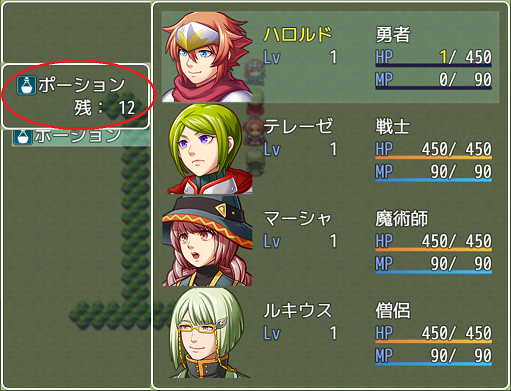
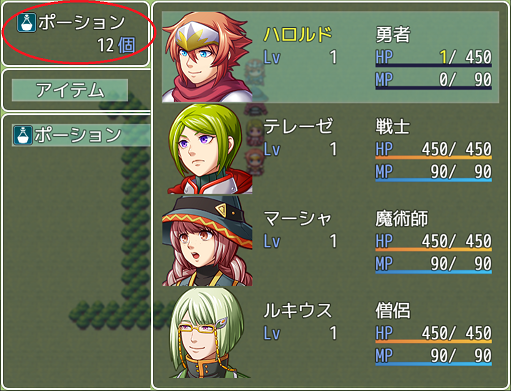

# 目次

- [基本情報](#【基本情報】)
- [機能](#【機能】)
- [プラグインパラメータ](#【プラグインパラメータ】)
- [プラグインコマンド](#【プラグインコマンド】)
- [メモタグ](#【メモタグ】)
- [使い方](#【使い方】)
- [連絡先](#【連絡先】)

---

### 【基本情報】

Released under the MIT License.  
<https://opensource.org/licenses/mit-license.php>

- 作成者：げれげれ
- 作成日：03/05/2021
- 非商用利用: 自由
- 商用利用: 自由
- 再配布: OK
- 加工: OK
- 加工後の再配布: OK

利用報告は別にいらんとですよ。  
（バグ報告はいただけるとありがたいです。）

---

### 【機能】

メニュー画面からアクターに対してアイテムを使用する際に  
アイテム名と残数を表示します。  
表示位置の微調整や表示単位の変更も可能です。

（デフォルト）  
  
（表示位置を画面トップに揃え、表示単位を「〇個」に変更）  

---

### 【プラグインパラメータ】

- window_y  
  アイテム残数ウインドウを表示するｙ座標です  
  デフォルト値 80

- position  
  単位の表示位置を前後から選べます
  デフォルト値 前

- unit  
  残数表示の単位です。  
  デフォルト値 「残：」

---

### 【プラグインコマンド】

### 【メモタグ】

ありません。

---

## 【使い方】

プラグイン登録につっこむだけです。

---

### 連絡先

Twitter: <https://twitter.com/geregeregere>  
GitHub: <https://github.com/gere-gere>
