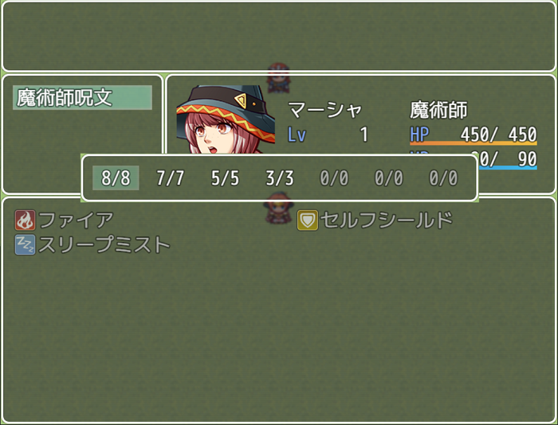
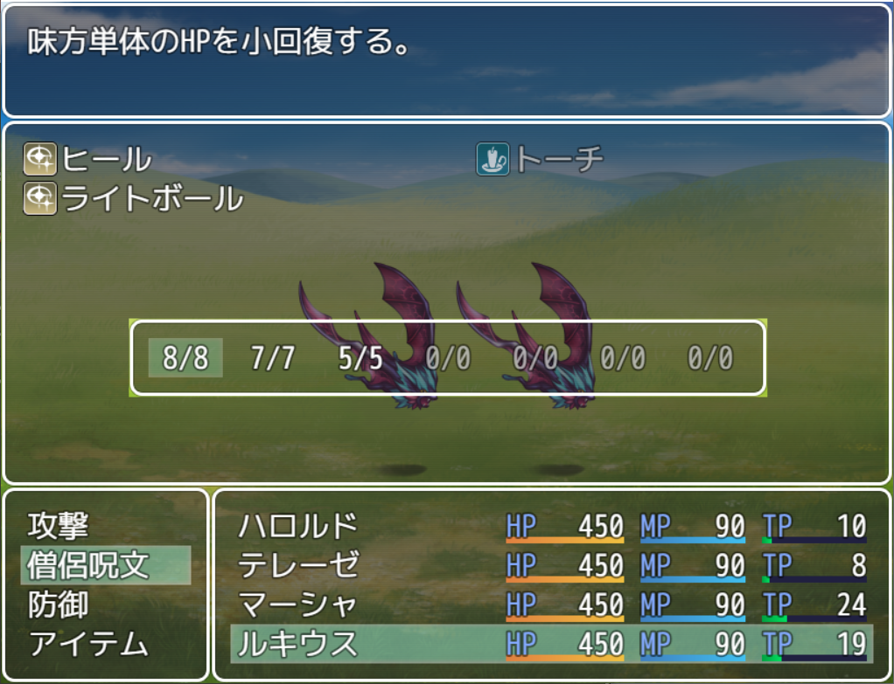
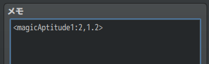
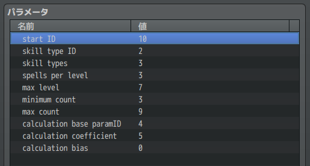
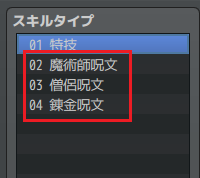
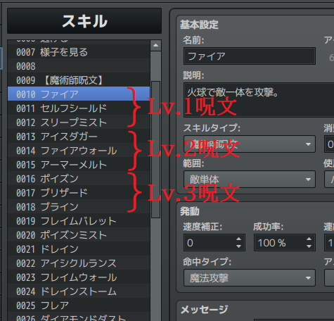
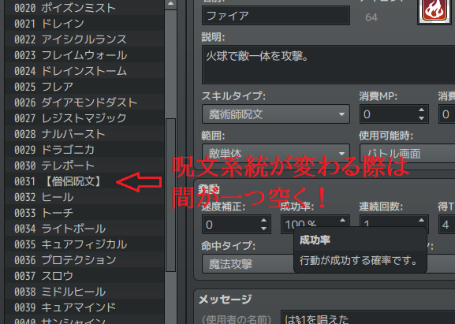

# 目次

 - [基本情報](#【基本情報】)
 - [機能](#【機能】)
 - [プラグインパラメータ](#【プラグインパラメータ】)
 - [プラグインコマンド](#【プラグインコマンド】)
 - [メモタグ](#【メモタグ】)
 - [使い方](#【使い方】)
 - [連絡先](#【連絡先】)

---
### 【基本情報】
Released under the MIT License.  
<https://opensource.org/licenses/mit-license.php>

- 作成者：げれげれ
- 作成日：06/25/2020
- 非商用利用: 自由
- 商用利用: 自由
- 再配布: OK
- 加工: OK
- 加工後の再配布: OK

利用報告やクレジットは別にいらんとですよ。  
（バグ報告はいただけるとありがたいです。）

---
### 【機能】
Wizardryなどでおなじみの、呪文をMPでなく使用回数で管理するシステムです。  
なお、RPGツクール本来のMPやTPの機能は残ったままなので、本プラグインの使用回数と  
組み合わせて利用することも可能です。
  
 - メニュー画面＞スキル画面
  
 - バトル画面  
  

---
### 【プラグインパラメータ】
 - start ID  
該当するスキルの開始スキルID  
デフォルト値 10  

 - skill type ID  
該当するスキルのスキルタイプID。該当するスキルが複数系統ある場合は  
「skill types」で指定した数だけ連番で対象とみなします。  
デフォルト値 1  

 - skill types  
呪文の系統数  
デフォルト値 3  

 - spells per level  
１レベル毎の呪文習得数(範囲 1～8)  
デフォルト値 3  

 - max level  
呪文の最大レベル(設定可能範囲　3～9)  
デフォルト値 7  

 - minimum count  
該当呪文レベル修得時の最小使用回数（未修得の場合は0）(設定可能範囲　0～99)  
デフォルト値 3  

 - max count  
呪文の最大使用回数(設定可能範囲　1～99)  
デフォルト値 9  

 - calculation base paramID  
呪文の使用回数を計算する基準となるパラメータIDを指定します(設定可能範囲 0～7)  
デフォルト値 4  

 - calculation coefficient  
呪文の使用回数を計算する際の係数。（設定可能範囲 0～10）  
デフォルト値 5  

 - calculation bias  
呪文の使用回数を計算する際の調整値。（設定可能範囲 -10～10）  
デフォルト値 0  

---
### 【プラグインコマンド】
 - GR_MagicRecover [アクターID]  
アクターIDで指定したアクターの魔法使用回数を全回復します。  
アクターIDの箇所を「All」とした場合はパーティメンバー全員を全回復します。  
宿屋などの回復イベントにご使用ください。  

記述例）  
GR_MagicRecover 1  
→アクターID:1のアクターの魔法使用回数を全回復します。  
GR_MagicRecover All  
→パーティに含まれているアクター全員の魔法使用回数を全回復します。  

---
### 【メモタグ】
`<magicAptitude1:スキルタイプID, 係数>`  
`<magicAptitude2:スキルタイプID, 係数>`  
`<magicAptitude3:スキルタイプID, 係数>`  
  
タグは番号違いで３つ用意しましたので、３つまで設定できます。  
上記メモタグを職業、およびスキルのメモ欄に記述することでレベルアップ時の  
使用回数計算に係数を掛けることができます。  
同じ系統の魔法を覚える職業でも、兼業職より専門職の方が使用回数が多い、  
というようなイメージです。  
また、スキルに設定することで使用回数を伸ばすパッシブスキルのような利用も可能です。  
なお、複数のスキルで同じタグが重複した場合、番号の大きい側で上書きされます。

---
## 【使い方】  
***以下、オーソドックスなWizardry系設定を再現する例を見てみましょう。***

 - プラグインパラメータ設定例  
 

 - 「skill type ID」「skill types」  
   
「skill type ID」を2と設定していますので、スキルタイプ02から当プラグインの  
適用対象となります。そして「skill types」が3なので、連番で３つ、つまり  
02、03、04の３種が使用回数で管理されるスキルとなります。  
  
 - 「start ID」「spells per level」「max level」  
「start ID」は対象となるスキルの開始位置を指します。今回はスキルID:10からを  
対象として設定しています。  
「spells per level」は１レベル当たりに覚える呪文数、「max level」は１系統の  
最大レベルです。  
古典的例だと１レベル当たり３つ、最大レベル７ですね。今回もそのように設定しています。  
その場合、スキルは以下のように設定します。  
  
スキルID:10から１レベルあたり３つずつ、スキルを作成しています。  
そして最大で７レベルまであるので「 3 × 7 = 21個 」のスキルが魔術師呪文として  
管理され、***次に一つ間を空けて*** 僧侶呪文を設定していきます。  
***系統の区切りは間を一つ空ける***点に注意してください。  
  
以下は同様に僧侶呪文を21個作成し、***間を一つ空けて*** 次の錬金呪文を21個作成します。  
  
スキル側の設定は以上となります。  
  
 - 「minimum count」「max count」  
「minimum count」は最低限保証される呪文使用回数です。該当レベルの呪文を一つでも  
習得していれば、minimum countで設定した回数を下回ることはありません。  
未修得の場合は一律でゼロとなります。  
「max count」は最大数です。いくらパラメータが上がってもmax countの使用回数に  
なることはりません。  
  
 - 「calculation base paramID」「calculation coefficient」「calculation bias」  
この３項目は使用回数を計算する上で必要となる設定です。  
「calculation base paramID」は「どのパラメータを元に使用回数を計算するか」という指定です。  
デフォルト値は4なので、魔法力の上昇に伴い使用回数も増加していきます。  
「calculation coefficient」は計算の際の係数、「calculation bias」は加減算される値を  
示しています。  

***計算式：***  
***『使用回数 = (X × ((A - 呪文レベル) × 0.01 + 0.24)  + B - (呪文レベル - 2) × 1.6) × 魔法適性』***  

X：ベース能力値  
A：calculation coefficient  
B：calculation bias  
（魔法適性は上述のメモタグによる係数。ここでは1.0とする）  
  
 例えばデフォルト値どおり  
「calculation coefficient:5」  
「calculation bias:0」  
の設定の場合、「魔法力20の時のLv1呪文の使用回数」は  
 『(20 × ((5 - 1) × 0.01 + 0.24) - 0 - (1 - 2) × 1.6) × 1.0 ＝ 7.2 』  
→小数点以下切り捨てて「7」となります。  

同様に魔法力20時のLv2呪文、Lv3呪文・・・Lv7呪文を計算していくと以下のようになります。  
「7, 5, 3, 1, 0, 0, 0」  

また、魔法力40時だと以下のようになります。  
「9, 9, 8, 6, 4, 2, 0」  

感覚的には  
***「calculation coefficient を高めに設定すると能力値に依る使用回数の伸びが良くなる」  
「calculation bias は能力値に依存せずに全レベルの使用回数を上下する」***  
と認識しておくと良いでしょう。  

---
### 連絡先
Twitter: <https://twitter.com/geregeregere>  
GitHub: <https://github.com/gere-gere>